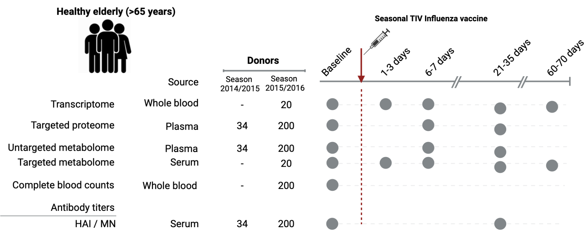

### Systems immunology reveals the molecular mechanisms of heterogeneous influenza vaccine response in the elderly

Publication: To be added.

#### Abstract

Vaccination-induced protection against influenza is greatly diminished and increasingly heterogeneous with age. We investigated longitudinally (up to five timepoints) a cohort of 234 elderly influenza vaccinees across two independent seasons including up to six modalities (multi-omics and immune parameters). System-level analyses revealed responders exhibited time-dependent changes attributed to a productive vaccine response across all omics layers whereas non-responders did not follow such dynamics, suggestive of systemic dysregulation. Through multi-omics integration, we identified key metabolites and proteins and their likely role in immune response to vaccination. High pre-vaccination IL-15 concentrations negatively associated with antibody production, further supported by experimental validation in mice revealing an IL-15-driven NK-cell axis with a suppressing role on antibody production. Finally, we propose unsaturated long-chain fatty acids as modulators of persistent inflammation in non-responders. Our findings highlight the potential for stratification of vaccinees and open avenues for possible pharmacological interventions to enhance vaccine responses.

#### Contents

This repository contains the R code used in this study to pre-process and analyse bulk transcriptomics, targeted proteomics (Olink) and untargeted metabolomics (General Metabolics) data. Furthermore, we provide the raw targeted proteomics data and untargeted metabolomics data for 702 samples (234 individuals over three timepoints).

#### Authors
Saumya Kumar & Martijn Zoodsma  
Principal investigator: Yang Li  
Centre for Individualised Infection Medicine, Helmholtz Centre for Infection Research
Hanover, Germany.

#### Contact
Yang Li (yang.li@helmholtz-hzi.de)
